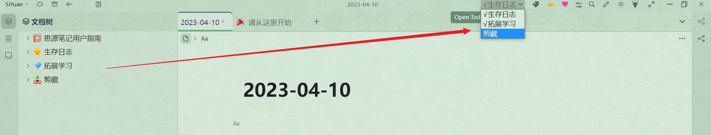
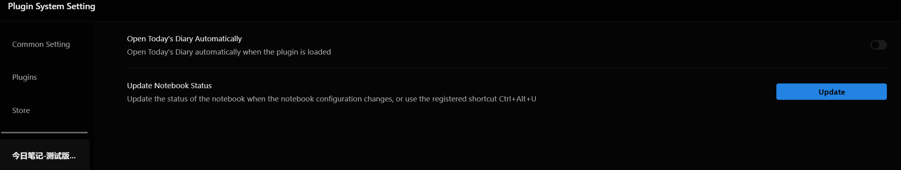
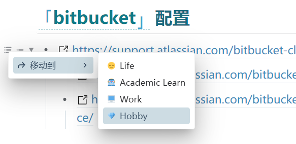

# Today's Note

This plugin is suitable for people who have multiple notebooks, allowing for quick creation of today's note in different notebooks and moving blocks among notes.

[中文](README.md)

## Introduction

1. When the plugin is launched, today's note is automatically created/opened.
    - Automatically open today's note in the notebook ranked first. If it doesn't exist, create and open it automatically.
    - Ignore "SiYuan User Guide".

2. The dropdown menu in the upper right corner provides options for quickly creating/opening today's note.
    - The dropdown menu lists all notebooks in order (See [FAQ](#q-how-is-the-sorting-of-notebooks-determined-can-it-be-adjusted)).
    - "SiYuan User Guide".
    - Click on a notebook to automatically open/create today's note.

3. The dropdown menu provides a flag indicating whether today's note has already been created for each notebook.
    - If there is a "√" flag before a notebook option, it means that note has already been created for that notebook.

4. When there is an update to a notebook (such as opening/closing/creating/moving a notebook), press the keyboard shortcut "ctrl+alt+u" to update the status.
    - The plugin can automatically track the creation status of the note, but it will not track the status of the notebooks.
    - Therefore, when opening, closing, creating, or moving a notebook, press the keyboard shortcut "ctrl+alt+u" to update the status.

5. Settings panel
    - You can choose in the settings panel whether to automatically open today's note when the plugin is enabled.
    - Notebook sorting schema.
    - Provides an "Update" button, which functions the same as the "Ctrl + Alt + U" shortcut key.
    - International support.

    

6. Moving Blocks
    - Select a block and press "Alt + Right Click" to bring up a moving block panel.
    - Choose a notebook to move the current block to the diary of the corresponding notebook for today.

    

## FAQ

### Q: Are there any limitations to using the plugin?

Due to the fact that the interface is registered in the top toolbar, it may not work properly under some themes. Currently, it has been confirmed that it cannot be used under Rem Craft.

### Q: I don't want to create a diary automatically.

Please toggle off "Open Today's Diary Automatically" in the plugin settings.

### Q: How is the sorting of notebooks determined? Can it be adjusted?

#### Background Information

In the Siyuan software, the document tree display sorting scheme can be divided into two categories:

- Custom sorting

    Notebooks can be freely dragged for sorting, and this order will be recorded by Siyuan.

- Other sorting

#### Plugin Settings

The plugin supports two sorting schemes in total, both of which can be configured in the settings.

- Same as custom sorting

    Under this scheme, the notebook sorting displayed by the plugin will only be consistent with the order in "Custom Sorting" mode, even if other "notebook tree display sorting schemes" are later changed, the order of notebooks displayed by the plugin will not change.

- Same as document tree

    Under this scheme, the notebook sorting displayed by the plugin will be exactly the same as the order of notebooks in the notebook tree.

After changing the Siyuan notebook sorting, press Ctrl + Alt + U to update the status.

### Q: How to change the notebook for automatically generated diary?

The plugin automatically selects the notebook that ranks first to generate a diary. If you want to change it, you need to change the order of notebooks in the plugin.

- For users who use "custom sorting" scheme, please move the default notebook to the top.
- For users who use other schemes
    - Switch to "Custom Sorting" and move the notebook to the first place
    - In the plugin settings page, select the notebook sorting scheme as "Same as custom sorting"
    - Click the "Update" button below
    - If you don't want the display of the notebook tree to be sorted by custom sorting, you can change to another sorting scheme after completing the above configuration, which will not affect the order in the plugin.

### Q: Why can't I bring up the move menu with "Alt + right-click" sometimes?

Firstly, please make sure that you are clicking on the icon beside the block. If you still cannot bring up the menu, try using the shortcut "Ctrl + Alt + U" to update the global status, and then try again.

### Q: Why is it so slow when moving header blocks?

It's not slow, it's just that there is a process when moving blocks.

In SiYuan, header blocks are not container blocks, so it is not possible to move them all at once. The current algorithm for moving header blocks is implemented by the plugin itself and requires recognition of which blocks belong to the current header, so it takes some time.

## CHANGELOG

[CHANGELOG](CHANGELOG.md)
