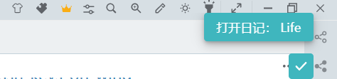
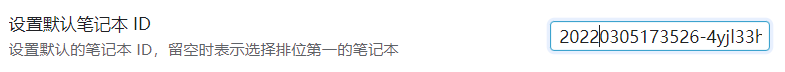
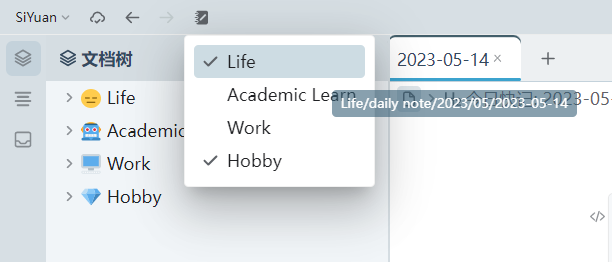
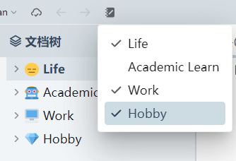
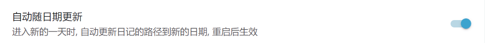
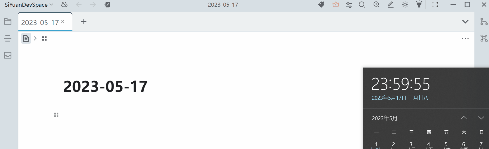
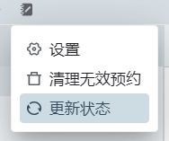
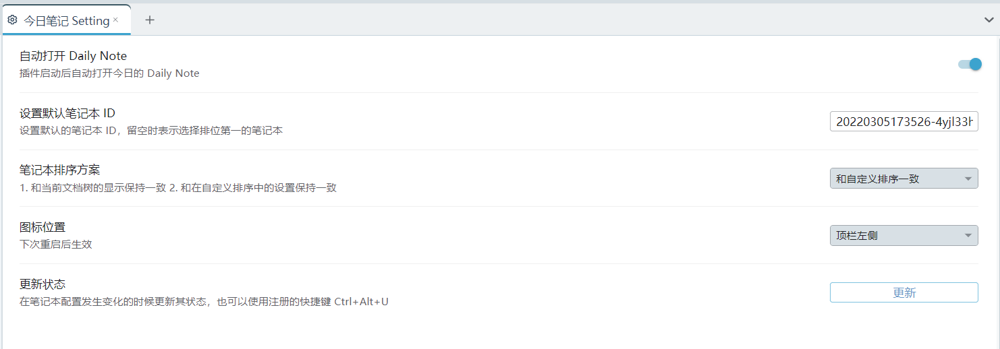
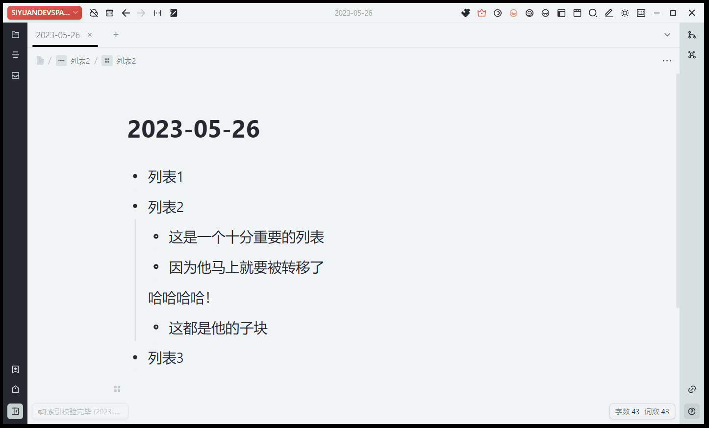

# 今日笔记

**本插件主要用于辅助在思源中的 Daily Note 笔记工作流**

- 提交 Issue 请访问[Github](https://github.com/frostime/siyuan-dailynote-today)
- 上不了 Github 可访问[国内托管](https://gitcode.net/frostime/siyuan-plugin-daily-note)
- **如果使用的过程中有问题，可以先阅读 [常见问题](#常见问题) 一节；如果还有问题，再到 Github 上提 Issue**
- 有问题尽量在 Github 或 Gitcode 上提，在群里问我不一定看得见

> 本文措辞混乱，文档中「日记」「笔记」「daily note」几个词可能会交替使用，不用在意，他们都表示一个含义.\
> 如果没有特别说明，「笔记」就是指「今天的日记」的意思.

## 我需要这个插件吗？

- 这个插件**主要面向使用 daily note 工作流**的人，如果你习惯在文档树中做笔记而非在日记中做笔记，那么这个插件也许不适合你
- 你可以单纯把这个插件当成一个**自动创建日记**的工具，就像 logseq 一启动就是今天的日记一样——使用这个插件你也可以一启动打开今天的日记
- 如果你**同时使用多个笔记本**，并且有同时在多个笔记本中编写日记的需求，使用这个插件你可以**快速打开指定笔记本的日记**
    - 注意：能打开的仅限今天的日记（毕竟叫今日笔记）
    - 如果你需要快速打开任意笔记本任意时间的日记，请使用日历插件（还未上架）
- 如果你有在多个笔记本中记日记的需求，又觉得不停打开多个日记很麻烦，你可以使用本插件提供的**移动块**功能，快速的把文档中的块移动到指定笔记本的日记中，避免频繁手动切换笔记本

## 这个插件可以做什么

### 1. 启动的时候自动创建笔记

<!--  -->

- 启动插件时，自动创建/打开今天的笔记，实现类似 logseq 中的效果
- 如果你不需要，可以在设置面板中关闭这一功能
- 在笔记本设置页面中设置的自定义路径以及模板都依然有效

#### 1.1 我有多个笔记本，哪个笔记本会被用来默认创建笔记呢？

- **默认情况**下，插件会**自动选择自定义顺序下排位第一**的笔记本，在这个笔记本内创建今天的日记
- 如果你不满意这个设定，请打开插件的「设置面板」中，然后**手动指定默认笔记本的 ID**
    - 操作流程：右键打开笔记本图标，点击「设置」按钮，再点击「复制ID」
    - 注意：只能填写一个笔记本的 ID 作为默认
    - 如果 ID 填写错误，则启动插件的时候会警告
    - 关于如何打开设置面板，请阅读文档后面的内容

<!--  -->

### 2. 左键点击图标，快速创建/打开今天的笔记

<!--  -->

- 下拉框中按照笔记本顺序排列，列出所有的笔记本
- 点击笔记本，可以快速打开/创建今日的笔记
- 笔记本名称前面带有 **「√」 符号** ，表示该笔记本下**已经创建了今天的日记**
    - 「√」标识会自动更新
- 下拉框会忽略「思源笔记用户指南」笔记本
- 在笔记本设置页面中设置的自定义路径以及模板都依然有效

> - **注意：不要理解错了**，这个下拉框不是用来选择默认的笔记本的，而是用来快速打开日记的！
> - 你完全可以把这个功能理解为把思源自带的「创建日记」的菜单移到最顶层，并添加了日记状态的显示。
> - 想要指定默认的笔记本，请到设置里面。

#### 2.1 举例说明

- 举个例子，当前我有四个笔记本，如果我点击下拉框中的按钮，会在打开对应笔记本下今天的日记。
- Life 、 work、 Hobby 这三个笔记本前面有「√」，表示这三个笔记本下已经创建了日记。

<!--  -->

此时，如果我再点击「Academic Learn」，那么就会在这个笔记本下新创建一个日记，然后你再打开下拉框，就会发现这个笔记本前面也出现了一个「√」符号。

#### 2.2 随日期更新

当过 0 点来到新的一天的时候，默认情况下插件不会自动更新，用户可以自行手动更新保证下拉框点击后打开新一天的日记。

如果嫌麻烦，也可以在设置中打开自动随日期更新的功能。

打开后，每当 0 点钟的时候，插件会自动报时更新。

> 注意: 2.8.8 版本由于禁用插件的时候无法自动释放资源，存在监听器残留问题，这个问题不算大，基本上没有太多消耗，而且关闭软件就可以解决了。\
> 但是如果你每天晚上都手动关闭笔记软件、第二天再手动打开，那似乎也没必要用到这个功能。\
> 当然你也可以把他当成一个纯粹的报时功能图一乐。

### 3. 右键点击图标，快速配置插件

<!--  -->

- 点击进入插件设置面板
    - 你也可以使用官方的入口进入设置面板，但是官方的操作我觉得太麻烦了，就提供了一个快捷入口
- 点击 “更新 ”更新插件全局状态
    - 细节请阅读[常见问题 - 更新状态](#Q-什么情况下我需要更新状态)

### 4. 设置面板

<!--  -->

### 5. 移动块到今天的 Daily Note 中

<!--  -->

- 选中块左侧的图标点击，在「今日笔记」菜单下有一个「移动块」项目
- 选择笔记本，可以把当前块移动到对应笔记本今天的日记下
- 支持移动整个嵌套结构
    - 如果移动列表，就会把整个列表结构都移动过去
    - 但是不可以移动单独的列表表项（这会引发思源的一个 bug），我已经在插件层面禁止这么做了
- 支持移动标题块下方所有内容
- 这个功能默认关闭，请在设置中打开

#### 5.1 移动块功能演示

- 把位于 Work 笔记本日记下的文档，移动到 Hobby 笔记本的日记下
- 由于选择的是标题块，所以下方所有内容也一并移动了过去
- 演示案例使用的是旧版的 Alt + 右键的交互方法，1.0.6 版本后正常点开块菜单即可

<!--  -->

## 常见问题

### Q: 我不想每次打开笔记的时候就创建日记。

请在插件设置里关闭「自动打开 Daily Note」。

### Q: 什么情况下我需要更新状态？

- 当打开、关闭、创建、移动笔记本的时候，请按更新状态
    - 插件可自动追踪笔记的创建情况，但是不会追踪笔记本的状态
- 如果发现「Alt + 右键」无法呼出移动菜单，尝试更新一下

### Q: 为什么移动标题块的时候这么卡？

并不是卡，而是移动块有一个过程。

思源笔记中标题块并不是一个容器块，没有办法一次性移动完成，需要识别哪些块属于当前标题下，所以比较慢。

## CHANGELOG

[CHANGELOG](CHANGELOG.md)

