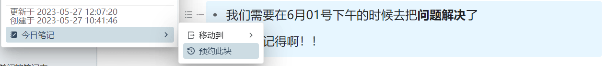
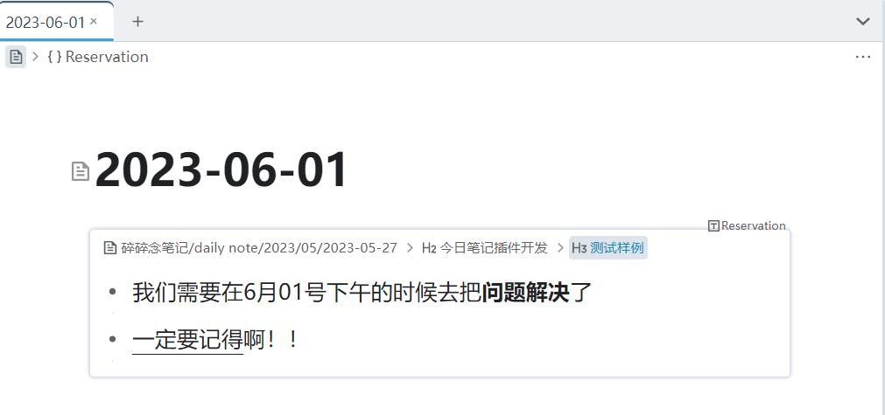

# 今日笔记

**本插件主要用于辅助在思源中的 Daily Note 笔记工作流**

- 提交 Issue 请访问[Github](https://github.com/frostime/siyuan-dailynote-today)
- 上不了 Github 可访问[国内托管](https://gitcode.net/frostime/siyuan-plugin-daily-note)
- **如果使用的过程中有问题，可以先阅读 [常见问题](#常见问题) 一节；如果还有问题，再到 Github 上提 Issue**
- 有问题尽量在 Github 或 Gitcode 上提，在群里问我不一定看得见

> 文档中「日记」「笔记」「daily note」几个词可能会交替使用，不用在意，他们都表示一个含义.

## 我需要这个插件吗？

- 这个插件**主要面向使用 daily note 工作流**的人，如果你习惯在文档树中做笔记而非在日记中做笔记，那么这个插件也许不适合你
- 你可以单纯把这个插件当成一个**自动创建日记**的工具，就像 logseq 一启动就是今天的日记一样——使用这个插件你也可以一启动打开今天的日记
- 如果你**同时使用多个笔记本**，并且有同时在多个笔记本中编写日记的需求，使用这个插件你可以**快速打开指定笔记本的日记**
    - 注意：能打开的仅限今天的日记（毕竟叫今日笔记）
    - 如果你需要快速打开任意笔记本任意时间的日记，请使用日历插件（还未上架）
- 如果你有在多个笔记本中记日记的需求，又觉得不停打开多个日记很麻烦，你可以使用本插件提供的**移动块**功能，快速的把文档中的块移动到指定笔记本的日记中，避免频繁手动切换笔记本

## 这个插件可以做什么

### 1. 启动的时候自动创建笔记

- 启动插件时，自动创建/打开今天的笔记，实现类似 logseq 中的效果
- 如果你不需要，可以在设置面板中关闭这一功能
- 在笔记本设置页面中设置的自定义路径以及模板都依然有效

#### 1.1 我有多个笔记本，哪个笔记本会被用来默认创建笔记呢？

- **默认情况**下，插件会**自动选择自定义顺序下排位第一**的笔记本，在这个笔记本内创建今天的日记
- 如果你不满意这个设定，请打开插件的「设置面板」中，然后**手动指定默认笔记本的 ID**
    - 操作流程：右键打开笔记本图标，点击「设置」按钮，再点击「复制ID」
    - 注意：只能填写一个笔记本的 ID 作为默认
    - 如果 ID 填写错误，则启动插件的时候会警告
    - 关于如何打开设置面板，请阅读文档后面的内容

### 2. 左键点击图标，快速创建/打开今天的笔记

- 下拉框中按照笔记本顺序排列，列出所有的笔记本
- 点击笔记本，可以快速打开/创建今日的笔记
- 笔记本名称前面带有 **「√」符号** ，表示该笔记本下**已经创建了今天的日记**
    - 「√」标识会自动更新
- 下拉框会忽略「思源笔记用户指南」笔记本
- 在笔记本设置页面中设置的自定义路径以及模板都依然有效

> - **注意：不要理解错了**，这个下拉框不是用来选择默认的笔记本的，而是用来快速打开日记的！详情解释见后面的 [常见问题-下拉框是选择默认打开的笔记本的吗](#q-下拉框是选择默认打开的笔记本的吗)

#### 2.1 随日期更新

每当 0 点钟的时候，插件会自动报时并更新日记的状态，此时你再点击顶栏菜单，打开的就是新一天的日记。但是，并不会自动帮你创建日记。

该功能可以在设置中关闭，但是这个设置计划将在思源更新 2.9 版本后被移除。

### 3. 右键点击图标，快速配置插件

- 点击进入插件设置面板
    - 你也可以使用官方的入口进入设置面板，但是官方的操作我觉得太麻烦了，就提供了一个快捷入口
- 点击 “更新 ”更新插件全局状态
    - 细节请阅读[常见问题 - 更新状态](#Q-什么情况下我需要更新状态)

### 4. 预约块

你可以把预约块理解成一个简单的日程管理或任务提醒。我们常常会遇到这种需求：需要在未来的某一天完成一个特定任务。这个时候就可以使用预约块功能：

1. 点击块，选择「预约此块」

    <!--  -->
    

2. 插件会自动匹配块内容中的日期时间，确定后，插件会帮你把这份预约记录下来

    被匹配到的时间会在确认对话框中高亮显示;。如下图所示, 插件匹配到了 `6月01号`, 并解析为 `2023-06-01`。

    <!--  -->
    

3. 等到当天的时候，插件在自动创建完日记后，会帮你把相关的预约以嵌入块的形式插入日记中

    <!--  -->
    

4. 如果你发现预约的嵌入块没有自动插入，可以点击图标菜单中的「更新」按钮更新文档

#### 注意

1. 当前版本 (1.1.0) 只有在插件自动创建/打开日记的时候, 才会自动插入
2. 你可以使用「更新」按钮来手动在日记中插入预约块
3. 目前支持的日期匹配规则有限，只有:
    - 标准年月日: `2020-04-01`, `2020/04/01`
    - 中文年月日: `2020年5月2号`, `2020年5月2日`
    - 日期之间可以有空格: `2020年5月2号` 和 `2020 年 5 月 2 号`都是可以的
    - 月份和日期可以加 0: `6月01日` , `06月01日`, `6月1日` 都是可以的
    - 可以不写年份, 这样默认会认为是同一年: 例如在 23 年的某一天, 写下的 `9月8号` 会被认为是 `2023-09-08`
    - 不可以写过去
    - 如果有多个复合规范的日期, 那么只有第一个会被匹配
4. 此功能**默认关闭**，请在手动在设置中开启

### 5. 移动块到今天的 Daily Note 中

- 选中块左侧的图标点击，在「今日笔记」菜单下有一个「移动块」项目; 选择笔记本，可以把**当前块**移动到对应笔记本今天的日记下
- 可以移动单个块
- 可以移动列表块
- 把标题块折叠后，可以移动整个标题块
- 这个功能默认关闭，请在设置中打开

> - 当前版本还可以使用旧版的 Alt + 右键方法，但是这个交互会在未来删除
> - 如果发现目标文档里没有移动过来的块, 不要惊慌，按「F5」刷新一下页面

### 6. 设置面板

> 具体的设置内容以软件内部为准

## 常见问题

### Q: 我不想每次打开笔记的时候就创建日记。

请在插件设置里关闭「自动打开 Daily Note」。

### Q: 下拉框是选择默认打开的笔记本的吗?

> - **注意：不要理解错了**，这个下拉框不是用来选择默认的笔记本的，而是用来快速打开日记的！
> - 你完全可以把这个功能理解为把思源自带的「创建日记」的菜单移到最顶层，并添加了日记状态的显示。
> - 想要指定默认的笔记本，请到设置里面。

- 举个例子，当前我有四个笔记本，如果我点击下拉框中的按钮，会在打开对应笔记本下今天的日记。
- Life 、 work、 Hobby 这三个笔记本前面有「√」，表示这三个笔记本下已经创建了日记。

此时，如果我再点击「Academic Learn」，那么就会在这个笔记本下新创建一个日记，然后你再打开下拉框，就会发现这个笔记本前面也出现了一个「√」符号。

### Q: 什么情况下我需要更新状态？

- 当打开、关闭、创建、移动笔记本的时候，请按更新状态
    - 插件可自动追踪笔记的创建情况，但是不会追踪笔记本的状态
- 手动更新当日的预约块

### Q: 为什么要为 daily note 工作流设计「移动块」功能？

思源和 Logseq 这些软件不同，有笔记本的概念。「移动块」是打开方式是在主笔记里写完后，通过移动块功能一键分配到对应的笔记本下。这样做的考虑是：

1. 逻辑上，可以让特定笔记本的主题的内容完全呆在自己的笔记本里，而非把所有内容放在主笔记，而主题笔记本下只有主题节点
2. 数据管理上，把块分摊到别的笔记本内有助于优化性能；这样当未来你可能不需要这个笔记本的时候，可以毫无顾虑地关闭笔记本。
    而如果把所有笔记堆积在同一个笔记本中，即便关闭了别的笔记本，对缓解性能问题的帮助也不会很大——因为内容块都在主笔记里。

## CHANGELOG

[CHANGELOG](CHANGELOG.md)

## 计划中...

- [x] 日记预约提醒功能 [#44](https://github.com/frostime/siyuan-dailynote-today/issues/44)
- [ ] 日记预约功能支持更多的日期匹配模板
    - 相对时间: 明天, 后天, 五天后
    - 周时间: 周二, 下周日
    - 英文时间
- [ ] 移动块后在原地留下块的引用或者链接 [#25](https://github.com/frostime/siyuan-dailynote-today/issues/25)
- [ ] 移动文档快 [#11](https://github.com/frostime/siyuan-dailynote-today/issues/11)
