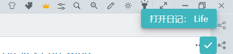
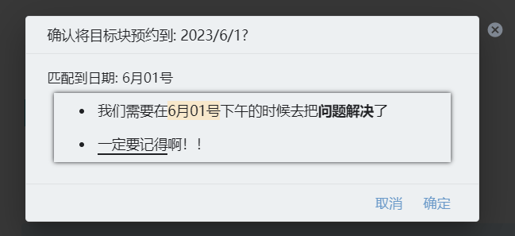

# Today's Note

**This plugin is mainly used for enhancement for daily note workflow in SiYuan.**

> The words "diary", "notes" and "daily note" may be used interchangeably in the document, so don't worry, they all mean the same thing.

## Do I need this plugin?

- This plugin** is mainly for people who use daily note workflow**, so if you're used to making notes in the document tree rather than in your daily notes, then this plugin may not be for you
- You can use this plugin simply as a tool to **automatically create a diary**, just like logseq who create today's diary on start up.
- If you **use multiple notebooks** and have the need to write multiple diaries in those notebooks at the same time, you can use this plugin to **quickly open the diary** of a specific notebook
    - Note: you can only open today's diary (after all, it's called "Daily Note Today")
    - If you need to quickly open the diary of any notebook at any time, please use the calendar plugin (not yet available, but will in future)
- If you have the need to take notes in more than one notebook, and feel that it is troublesome to frequently open multiple diaries, you can use the **Move Blocks** feature provided by this plugin to quickly move the blocks in a document to the diary in the specified notebook, avoiding frequent manual switching of notebooks

## What can this plugin to

### 1. Auto-create daily note for today

- When you start the plugin, it automatically creates/opens today's daily note, achieving a similar effect as in logseq
- If you don't need it, you can turn off this feature in the settings panel
- The custom paths and templates set in the notebook settings page are still valid

#### 1.1 I have multiple notebooks, which notebook will be used to create notes by default?

- By **default**, the plugin will **automatically select the notebook that is sorted first** and create today's diary in this notebook
- If you are not satisfied with thie default setting, open the plugin in the "Settings Panel" and then **manually specify the default notebook ID**
    - Procedure: Right-click to open the notebook icon, click the "Settings" button, and then click "Copy ID".
    - Note: Only one notebook ID can be filled in as the default.
    - If the ID is incorrectly filled in, a warning will be given when the plugin is launched
    - For more information on how to open the settings panel, please read the later part of the document

### 2. Left lick the icon, quickly creating/opening today's note.

- The dropdown menu lists all notebooks in order.
- Click on a notebook to open/create today's note.
- If there is a "√" flag before a notebook option, it means that diary has already been created for that notebook.
- Ignore "SiYuan User Guide" notebook by default.
- The custom paths and templates set in the notebook settings page are still valid

> - **Note: Don't misunderstand**, this drop-down box is not for selecting the default notebook, but for opening the diary quickly! For more details, see [FAQ-Q: Is the dropdown box used...](#q-is-the-dropdown-box-is-used-for-selecting-the-default-notebook)

#### 2.1 Update with date

At 0 o'clock the plug-in will automatically chime in and update the status of your diary, at which point you can click on the top bar menu to open the diary for the new day. However, it does not automatically create a diary for you.

This feature can be turned off in the settings, but this setting is scheduled to be removed with the SiS update version 2.9.

### 3. Right click the icon, quickly configuration.

- Click to enter the plugin settings panel
    - You can also use the official portal to enter the settings panel, but the official operation I think is too much trouble, so here provides a shortcut portal
- Click "Update" to update the global status
    - Read[FAQ](#q-when-do-i-need-to-update-status) for details

### 4. Reserve a block

You can think of the reservation block as a simple schedule management or task reminder tool. We often encounter such requirements: we need to complete a specific task on a future date. In this case, you can use the reservation block feature:

1. Click the block and select "Reserve this block".

    
2. The plugin will automatically match the date and time in the block content, and after confirmation, the plugin will help you record the reservation.

    The matched time will be highlighted in the confirmation dialog;. As you can see below, the plug-in matches `6月01号` and resolves to `2023-06-01`.

    > `6月01号` is the date representative in chinese.

    
4. When the day arrives, the plugin will automatically insert the related reservations as embedded blocks into the diary entry.

    

### Notice

1. The current version (1.1.0) will only insert automatically when the diary is created/opened automatically by the plugin
2. You can use the 'Update' button to manually insert appointment blocks into the diary
3. The date matching rules currently supported are limited to.
    - Standard date: `2020-04-01`, `2020/04/01`
    - --Chinese year, month and day: `2020年5月2号`, `2020年5月2日`--
    - There can be spaces between dates: `2020-02-01` and `2020 - 02 - 01` are both possible
    - The month and the date can be added with 0: `6-01`, `6-01`, `06-01` are all possible
    - The year can be left out, so that the same year is assumed by default: for example, on a day in the year 23, the date `09/08` will be assumed to be `2023-09-08`.
    - It is not possible to write in the past
    - If there are multiple dates in the compound specification, then only the first one will be matched
4. This feature is **disabled by default** and should be turned on manually in the settings.

> It's a pity that this version does not support English date mode very well, while it will be improved in later versions.

### 5. Move blocks into today's daily note

- Select the icon leftside of a block and press "Alt + Right Click" to bring up a moving block panel. Choose a notebook to move the current block to the diary of the corresponding notebook for today.
- Support moving single block
- Support moving a list item
- Fold the header block, you can move the entire header and it's children blocks
- Disabled by default, you can enable it in the setting panel

> - You can also use alt + right click, but it will be remove in the future
> If you find that there are no blocks in the target document, don't panic, press 'F5' to refresh the page.

### 6. Setting pannel

## FAQ

### Q: I don't want to create a diary automatically.

Please toggle off "Open Today's Diary Automatically" in the plugin settings.

### Q: Is the dropdown box used for selecting the default notebook?

> - **Note: Don't misunderstand**, this drop-down box is not for selecting the default notebook, but for opening the diary quickly!
> - You can totally interpret this as moving the "Create Diary" menu that comes with Siyuan to the top level and adding a diary status display.
> - To specify the default notebook, please go to Settings Panel.

For example, I currently have four notebooks. If I click the button in the drop-down box, it will open the diary for today in the corresponding notebook.
Life, work, and Hobby have a "√" in front of them, which means that they have already created diaries.

At this point, if I click on "Academic Learn", then a new diary will be created under this notebook, and then you can open the drop-down box again and you will see that a √ symbol also appears in front of this notebook.

### Q: When do I need to "Update" status

- When there is an update to a notebook (such as opening/closing/creating/moving a notebook), press the keyboard shortcut "ctrl+alt+u" to update the status.
    - The plugin can automatically track the creation status of the note, but it will not track the status of the notebooks.
- When "Alt + right click" can note bring up moving menu, try updating.

### Q: Why is it so slow when moving header blocks?

It's not slow, it's just that there is a process when moving blocks.

In SiYuan, header blocks are not container blocks, so it is not possible to move them all at once. It requires recognition of which blocks belong to the current header, so it takes some time.

## CHANGELOG

[CHANGELOG](CHANGELOG.md)
