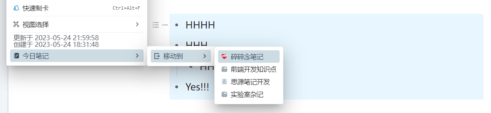

# Today's Note

This plugin is suitable for people who have multiple notebooks, allowing for quick creation of today's note in different notebooks and moving blocks among notes.

## Introduction

### 1. Auto-create daily note for today

- When the plugin is launched, today's note is automatically created/opened.
- Set the default notebook for creating daily note in setting panel.
    - Please copy the right notebook id into the setting text box.
- If no notebook is mannually selected as default, the plugin will choose the first notebook as default.
    - For what is "The first Notebook" (See [FAQ](#q-how-is-the-sorting-of-notebooks-determined-can-it-be-adjusted)).
- Ignore "SiYuan User Guide".

### 2. Left lick the icon, quickly creating/opening today's note.

- The dropdown menu lists all notebooks in order (See [FAQ](#q-how-is-the-sorting-of-notebooks-determined-can-it-be-adjusted)).
- Click on a notebook to automatically open/create today's note.
- If there is a "√" flag before a notebook option, it means that note has already been created for that notebook.
    - Plugin update "√" flag automatically.
- Ignore "SiYuan User Guide".

### 3. Right click the icon, quickly configuration.

- Click "Setting" to open Setting Pannel
- Click "Update" to update the global status

### 4. Setting pannel

### 5. Move blocks into today's daily note

- Select a block and press "Alt + Right Click" to bring up a moving block panel.
- Choose a notebook to move the current block to the diary of the corresponding notebook for today.
- Support moving the whole nested blocks.

<!--  -->

## FAQ

### Q: I don't want to create a diary automatically.

Please toggle off "Open Today's Diary Automatically" in the plugin settings.

### Q: When do I need to "Update" status

- When there is an update to a notebook (such as opening/closing/creating/moving a notebook), press the keyboard shortcut "ctrl+alt+u" to update the status.
    - The plugin can automatically track the creation status of the note, but it will not track the status of the notebooks.
- When "Alt + right click" can note bring up moving menu, try updating.

### Q: How is the sorting of notebooks determined? Can it be adjusted?

#### Background Information

In the Siyuan software, the document tree display sorting scheme can be divided into two categories:

- Custom sorting

    Notebooks can be freely dragged for sorting, and this order will be recorded by Siyuan.

- Other sorting

#### Plugin Settings

The plugin supports two sorting schemes in total, both of which can be configured in the settings.

- Same as custom sorting

    Under this scheme, the notebook sorting displayed by the plugin will only be consistent with the order in "Custom Sorting" mode, even if other "notebook tree display sorting schemes" are later changed, the order of notebooks displayed by the plugin will not change.

- Same as document tree

    Under this scheme, the notebook sorting displayed by the plugin will be exactly the same as the order of notebooks in the notebook tree.

After changing the Siyuan notebook sorting, press Ctrl + Alt + U to update the status.

### Q: Why is it so slow when moving header blocks?

It's not slow, it's just that there is a process when moving blocks.

In SiYuan, header blocks are not container blocks, so it is not possible to move them all at once. It requires recognition of which blocks belong to the current header, so it takes some time.

## CHANGELOG

[CHANGELOG](CHANGELOG.md)
