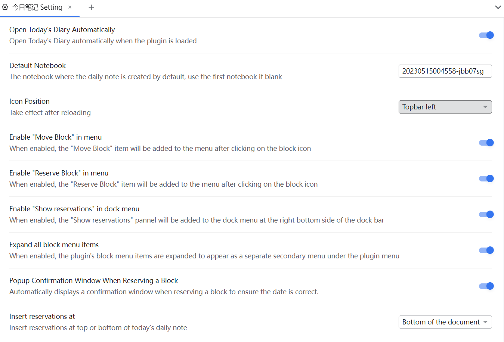

[README 中文](README.md)

# Daily Note Today


**This plugin is mainly used for enhancement for daily note workflow in SiYuan.**

> The words "diary", "notes" and "daily note" may be used interchangeably in the document, so don't worry, they all mean the same thing.


> See changelog in: [CHANGELOG.md](CHANGELOG.md)

## Do I need this plugin?

- This plugin** is mainly for people who use daily note workflow**, so if you're used to making notes in the document tree rather than in your daily notes, then this plugin may not be for you
- You can use this plugin simply as a tool to **automatically create a diary**, just like logseq who create today's diary on start up.
- If you **use multiple notebooks** and have the need to write multiple diaries in those notebooks at the same time, you can use this plugin to **quickly open the diary** of a specific notebook
    - Note: you can only open today's diary (after all, it's called "Daily Note Today")
    - If you need to quickly open the diary of any notebook at any time, please use the calendar plugin (not yet available, but will in future)
- If you have the need to take notes in more than one notebook, and feel that it is troublesome to frequently open multiple diaries, you can use the **Move Blocks** feature provided by this plugin to quickly move the blocks in a document to the diary in the specified notebook, avoiding frequent manual switching of notebooks
- You can also use this plugin as a simple **schedule management** tool. This plugin provides the function of "reservation block", hich can be used as a tool to manage today's errands


## What can this plugin to

### 1. Auto-create daily note for today


- When you start the plugin, it automatically creates/opens today's daily note, achieving a similar effect as in logseq
- If you don't need it, you can turn off this feature in the settings panel
- The custom paths and templates set in the notebook settings page are still valid

> If you have enabled multi-device synchronization, duplicate daily notes may occur. For more details, please refer to [FAQ](#q-why-are-there-duplicateconflict-daily-notes)

#### 1.1 I have multiple notebooks, which notebook will be used to create notes by default?


- By **default**, the plugin will **automatically select the notebook that is sorted first** and create today's diary in this notebook
- If you are not satisfied with thie default setting, open the plugin in the "Settings Panel" and then **manually specify the default notebook ID**
    - Procedure: Right-click to open the notebook icon, click the "Settings" button, and then click "Copy ID".
    - Note: Only one notebook ID can be filled in as the default.
    - If the ID is incorrectly filled in, a warning will be given when the plugin is launched
    - For more information on how to open the settings panel, please read the later part of the document


## 1.2 Blacklist

If you have too many notebooks, you can choose to add some notebooks to the blacklist, so that these notebooks will not appear in the dropdown list


### 2. Left lick the icon, quickly creating/opening today's note.


- The dropdown menu lists all notebooks in order.
- Click on a notebook to open/create today's note.
- If there is a "√" flag before a notebook option, it means that diary has already been created for that notebook.
- Ignore "SiYuan User Guide" notebook by default.
- The custom paths and templates set in the notebook settings page are still valid

> - **Note: Don't misunderstand**, this drop-down box is not for selecting the default notebook, but for opening the diary quickly! For more details, see [FAQ-Q: Is the dropdown box used...](#q-is-the-dropdown-box-is-used-for-selecting-the-default-notebook)

#### 2.1 Update with date

At 0 o'clock the plug-in will automatically chime in and update the status of your diary, at which point you can click on the top bar menu to open the diary for the new day. However, it does not automatically create a diary for you.


### 3. Right click the icon, quickly configuration.


- Click to enter the plugin settings panel
    - You can also use the official portal to enter the settings panel, but the official operation I think is too much trouble, so here provides a shortcut portal
- Click "Update" to update the global status
    - Read[FAQ](#q-when-do-i-need-to-update-status) for details

### 4. Reserve a block

You can think of the reservation block as a simple schedule management or task reminder tool. We often encounter such requirements: we need to complete a specific task on a future date. In this case, you can use the reservation block feature:

1. Click the block and select "Reserve this block".

    <!--  -->
    
    <!--  -->

2. The plugin will automatically match the date and time in the block content, and after confirmation, the plugin will help you record the reservation.

    The matched time will be highlighted in the confirmation dialog;. As you can see below, the plug-in matches `06-24` and resolves to `2023-06-01`.

    
    <!--  -->

3. When the day arrives, the plugin will automatically insert the related reservations as embedded blocks into the diary entry.

    
    <!--  -->

4. If you find that the embedded block for the reservation is not inserted automatically, you can update the document by clicking on the 'Update' button in the icon menu

5. After completing the reservation block, a custom attribute `custom-reservation` will be automatically added to the block and memo will be filled in, making it easier for users to identify which blocks have been reserved.

    

    

6. Click again on a block that has already been reserved and you can choose to 'Cancel Reservation'
7. By default, all reservations will be inserted as an embedded block at the beginning of the document. If you are not satisfied with the default behavior, you can change it in the settings.


You can customize the CSS styles to display these reservation blocks. Here is an example that you can add to your code snippet:

```css
.protyle-wysiwyg div[custom-reservation] {
    border-style: dashed;
    border-width: 1.5px;
    border-radius: 0.5rem;
    border-color: var(--b3-theme-primary);
}
```

With custom attributes, you can use SQL to query all reservation blocks. For more information, see [FAQs](#q-how-to-view-all-reservation-blocks).

#### Hot key

Press `Shift+Alt+R` to trigger the reservation quickly.

#### 4.1 View scheduled appointments

There is a panel provided in the Dock to view scheduled appointments.


Click the counter to the right side of the date, you can view all the reservations that day.


Note that only future appointments can be viewed here, and due to the limitation of data query from SiYuan, up to 32 appointments can be viewed at most. If you want to view all appointments more freely, please refer to [FAQs](#q-how-to-view-all-reservation-blocks).


#### 4.2 Currently supported date templates

- Standard year, month and day
    - `2020-04-01`, `2020/04/01`, `2020.04.01`
    - `2020年5月2号`, `2020年5月2日` in Chinese
    - Dates can have spaces between them: `2020-04-01` and `2020 - 04 - 01` are both ok
    - Month and date can be added with 0: `04-01`, `04-1`, `4-1` are possible
    - You can leave out the year, so that it will be considered the same year by default: for example, on a day in the year 23, the `09-08` will be considered as `2023-09-08`.
    - > Unfortunately, this plugin does not plan to provide support for users who can live beyond the year 3000, so you can only use years before 2999.

- Relative time
    - N days later, e.g. `10 days later`; Arabic numerals only

- English date support by using [chrono](https://github.com/wanasit/chrono)

    - Today, Tomorrow, Yesterday
    - 17 August 2023
    - This Friday
    - 2 weeks from now
    - Note: These english dates are currently not supported for highlighting matching text items in the confirmation window

Translated with www.DeepL.com/Translator (free version)


####  4.2 Notice

1. The embeded block for reservations will be insert automatically only when the diary is created/opened automatically by the plugin
2. You can use the 'Update' button to manually insert appointment blocks into the diary
3. The date matching rules currently
    - It is not allowed to write in the past
    - If there are multiple dates in the compound specification, then only the first one will be matched
4. This feature is **disabled by default** and should be turned on manually in the settings.


> It's a pity that this version does not support English date mode very well, while it will be improved in later versions.

### 5. Move blocks into today's daily note

<!--  -->


- Select the icon leftside of a block and press "Alt + Right Click" to bring up a moving block panel. Choose a notebook to move the current block to the diary of the corresponding notebook for today.
- Support moving single block
- Support moving a list item
- Move the entire header and it's children blocks
- Disabled by default, you can enable it in the setting panel


### 6. Setting pannel

<!--  -->


## Compatibel function: Add document attribute to past Daily Notes

Starting from version 2.11.1, SiYuan automatically adds the `custom-dailynote-yyyymmdd` attribute to the document when creating a daily note, making it easier to distinguish daily note documents from regular documents.

<span style="font-weight: bold; color: var(--b3-theme-primary)">For more details, please refer to the Github Issue <a href="(https://github.com/siyuan-note/siyuan/issues/9807)">#9807</a></span><span style="font-size: 1.2em; font-weight: bold;">

Afterwards, you can query daily notes using SQL statements similar to the following example. The statement `custom-dailynote-202312%` will match all daily notes from December 2023:

```sql
select distinct B.* from blocks as B join attributes as A
on B.id = A.block_id
where A.name like 'custom-dailynote-202312%'
order by A.value desc;
```

While you need to have the corresponding document attributes set in your daily notes, which do not exist in your past daily notes. To facilitate compatibility, this plugin provides a feature to add document attributes to past daily notes.

- Open the plugin settings - Daily Notes
- Click the "Add document attribute to past Daily Notes" button


## FAQ


### Q: I don't want to create a diary automatically.

Please toggle off "Open Today's Diary Automatically" in the plugin settings.

### Q: Why are there duplicate/conflict daily notes?

The conditions for this issue to occur are:

1. The automatic creation of daily notes is enabled.
2. Multiple devices are being used for synchronization.

The reason for this problem is that in the architecture of SiYuan, **the plugin's initialization runs before the data synchronization during startup**. If you previously created a daily note on Device A and then open Device B, the plugin will automatically create another daily note for you. Only after that, Obsidian will synchronize the data, resulting in duplicate daily notes, one from the previous creation on Device A and another from the current creation on Device B.

### Q: Is the dropdown box used for selecting the default notebook?

> - **Note: Don't misunderstand**, this drop-down box is not for selecting the default notebook, but for opening the diary quickly!
> - You can totally interpret this as moving the "Create Diary" menu that comes with Siyuan to the top level and adding a diary status display.
> - To specify the default notebook, please go to Settings Panel.


For example, I currently have four notebooks. If I click the button in the drop-down box, it will open the diary for today in the corresponding notebook.
Life, work, and Hobby have a "√" in front of them, which means that they have already created diaries.


At this point, if I click on "Academic Learn", then a new diary will be created under this notebook, and then you can open the drop-down box again and you will see that a √ symbol also appears in front of this notebook.

### Q: How to query all reservation blocks by SQL?

If the plugin version is 1.1.1 or higher, all inserted blocks will have the `custom-reservation` attribute set, so you can use SQL to query them. Here is the template:

```sql
select B.*
from blocks as B
inner join attributes as A
on(
  A.block_id = B.id and 
  A.name = 'custom-reservation'
  and A.value >= strftime('%Y%m%d', datetime('now')) 
) order by A.value;
```

Note that the `and A.value >= strftime('%Y%m%d', datetime('now'))` filters out all expired reservations. If you want to view past reservations regardless, you can remove this part.

If you have installed the Query widget, you can use this SQL:

```sql
select
A.value||'000000' as __10____date__ReservationDate,
'['
||substr(B.created,1,4)
|| '-' || substr(B.created,5,2)
|| '-' || substr(B.created,7,2)
|| '](siyuan://blocks/' || B.id|| ')' as __11____pre__Created,
substr(B.content,1,30) as __22____pre__Content
from blocks as B
inner join attributes as A
on(
  A.block_id = B.id and 
  A.name = 'custom-reservation'
  and A.value >= strftime('%Y%m%d', datetime('now')) 
) order by A.value;
```


### Q: When do I need to "Update" status

- When there is an update to a notebook (such as opening/closing/creating/moving a notebook), press the keyboard shortcut "ctrl+alt+u" to update the status.
    - The plugin can automatically track the creation status of the note, but it will not track the status of the notebooks.
- When "Alt + right click" can note bring up moving menu, try updating.
- Manual update of the day's reservation block

### Q: Why did you design the 'moving blocks' feature for the daily note workflow?

Siyuan is different from Logseq, it has the concept of notebooks. The way to use 'move block' is to write in the main notebook and then assign it to the corresponding notebook with one click through the move block function. This is done with the following considerations in mind:

1. logically, it allows the content of a specific notebook's topic to stay entirely in its own notebook, rather than having all the content in the main notebook with only topic nodes under the topic notebook
2. data management-wise, spreading the blocks within other notebooks helps optimise performance; so that when you may not need the notebook in the future, you can close it without any worries.
    Whereas if all notes are stacked in the same notebook, even if you close other notebooks, it won't help much to alleviate performance problems - because the content blocks are all in the main notebook.


## CHANGELOG

[CHANGELOG](CHANGELOG.md)
